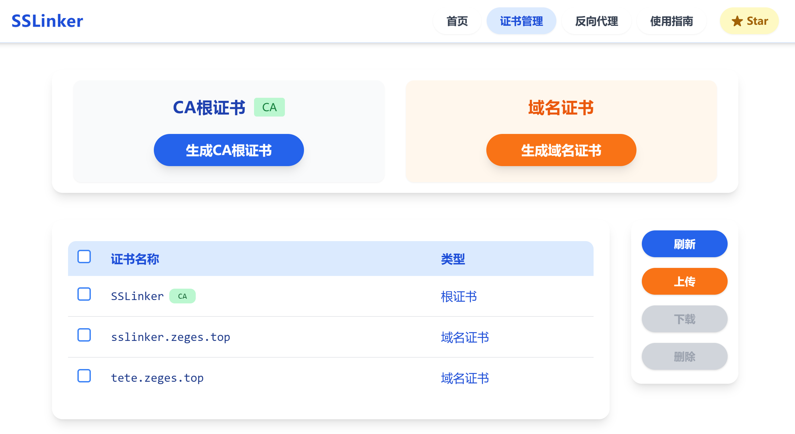
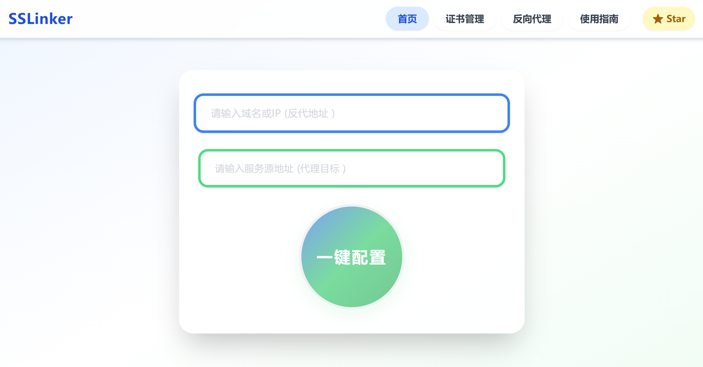
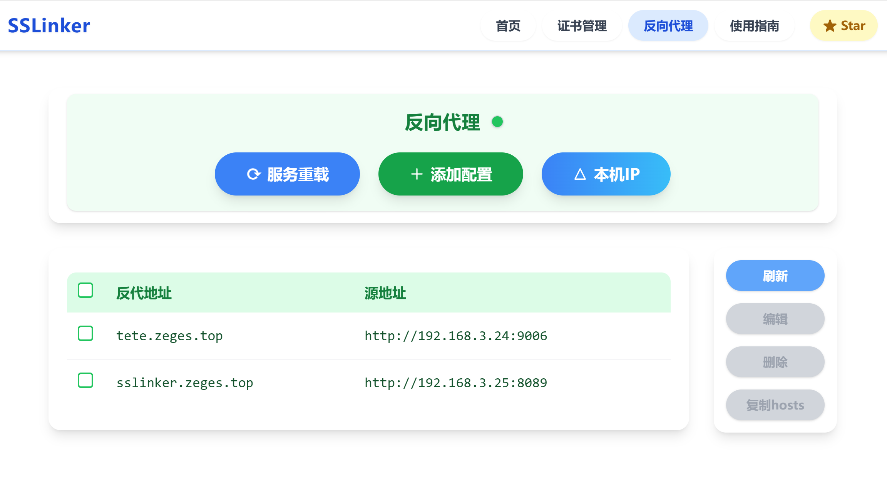

# SSlinker

内网 SSL 与反向代理自动化平台

---



## 项目简介
SSlinker 是一款专为内网环境设计的 SSL 证书自动化管理与 Nginx 反向代理配置平台。支持一键生成根 CA、域名证书、自动配置反向代理，提供证书批量管理、跨平台 CA 导入、hosts 配置指引等功能，助力企业/团队快速实现内网 HTTPS 化。

---

## 主要特性
- 🚀 一键自动生成根 CA 证书、域名证书并配置反代
- 🗂️ 支持证书上传、批量管理、批量删除、证书下载
- 🖥️ 现代化卡片式 UI，操作简单，交互清晰
- 🔄 反向代理配置一键生成、编辑、删除、服务重载
- 📝 hosts 批量导出、CA 导入指引，支持多平台
- 🐳 提供 Docker 镜像，开箱即用

---

## 环境依赖与安装方法

### 1. 克隆项目
```bash
git clone https://github.com/your-org/SSlinker.git
cd SSlinker
```

### 2. 安装后端依赖
- Python 3.10+
- pip

```bash
cd backend
python3 -m venv venv
source venv/bin/activate
pip install -r requirements.txt
```

### 3. 安装前端依赖
- Node.js 20+
- npm 或 yarn

```bash
cd ../frontend
npm install
# 或 yarn
```

---

## 快速使用

### 1. 启动后端
```bash
cd backend
uvicorn main:app --host 0.0.0.0 --port 8000
```

### 2. 启动前端
```bash
cd frontend
npm run dev
# 或 yarn run dev
```

浏览器访问：http://localhost:5173

---

## Docker 安装与部署

### 1. 拉取镜像
```bash
docker pull izege/sslinker:latest
```

### 2. CLI 运行容器
```bash
docker run -d \
  --name sslinker \
  -p 80:80 \
  -p 443:443 \
  -p 8089:8000 \
  -v $PWD/docker/certs:/certs \
  -v $PWD/docker/nginx:/etc/nginx/conf.d \
  -v $PWD/docker/config:/app/backend/config \
  -e PYTHONUNBUFFERED=1 \
  izege/sslinker:latest
```

- 证书持久化目录：`./docker/certs` 挂载到容器 `/certs`
- Nginx 配置目录：`./docker/nginx` 挂载到容器 `/etc/nginx/conf.d`
- 平台配置目录：`./docker/config` 挂载到容器 `/app/backend/config`
- 前端端口：80，后端 API 端口：8000（可通过 8089 访问）
- 支持 HTTPS（443 端口）
- 环境变量 `PYTHONUNBUFFERED=1` 保证日志实时输出

如需自定义数据路径，请调整 `-v` 挂载参数。

### 3. 使用 Docker Compose 部署（推荐）

1. 在项目根目录准备 `compose.yaml` 文件（内容如下）：

```yaml
services:
  app:
    image: izege/sslinker
    container_name: sslinker
    ports:
      - "8089:8000"
      - "80:80"
      - "443:443"
    volumes:
      - ./docker/certs:/certs
      - ./docker/nginx:/etc/nginx/conf.d
      - ./docker/config:/app/backend/config
    environment:
      - PYTHONUNBUFFERED=1
    restart: unless-stopped
```

2. 启动服务：
```bash
docker compose up -d
```

3. 浏览器访问：
```
http://localhost:8089
```

---

## 使用说明

### 1. 一键配置 SSL 反代
- 在首页填写【反代地址】（如 test.local）、【服务源地址】（如 http://10.0.0.11:8080）
- 点击“一键配置”，自动生成根 CA、域名证书并配置 nginx 反代



### 2. 证书管理
- 查看、下载、上传各类证书（包括自签和外部网站证书）
- 支持批量删除、证书详情查看
- 支持自定义上传第三方/外部证书，反代功能不局限于内网自签场景


### 3. 反向代理管理
- 查看所有反代配置，支持编辑、删除、批量操作
- 支持服务重载，实时生效



### 4. CA 导入与 hosts 配置
- 按照“使用指南”页面指引，将 CA 根证书导入到操作系统或浏览器
- 添加hosts信息，支持一键复制 hosts 规则，适配多平台

---

## 反馈与贡献

- 如有建议或问题，欢迎提交 [Issue](https://github.com/your-org/SSlinker/issues) 或 PR
- 欢迎 Star & Fork！

---

